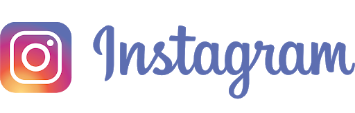

<h1 align="center"> Pagina-inicial-do-Instagram </h1>

 Nesse projeto reconstruida a página inicial de login do Instagram, no qual será abordado o conceito sobre CSS utilizando Flexbox, uma metodologia de posicionamento de elementos em tela mais utilizada no mercado assim como conceitos de responsividade.
 
 
 Nesse projeto reconstruida a página inicial de login do Instagram, no qual será abordado o conceito sobre CSS utilizando Flexbox, uma metodologia de posicionamento de elementos em tela mais utilizada no mercado assim como conceitos de responsividade. 

 

### Imagens do projeto
<h3>Imagen inicial</h3>

<h3>Imagen com responsividade max-width: 1024px</h3>

<h3>Imagen com responsividade max-width: 650px</h3>

### Conceitos aplicados no projeto
- Criação de página do instagram ultilizando conceitos em Flexbox
    - Aplicando conceito de HTML5 e CSS 3 
    - Subindo para GitHub

### Atividades realizadas 

- [X] Criação da página inicial
- [X] Estilização via CSS5
- [X] Aplicação de posicionamento dos elementos
- [X] Criação de repositório no GitHub
- [X] Criação e edição do Readme
- [X] Finalização do projeto

## O que a plataforma é capaz de fazer :checkered_flag:

:trophy: Plataforma criada com conceito de responsividade.
:trophy: Criação e adição de repositório no GitHub
:trophy: Criação e edição do Readme

## Como está andamento do projeto.

> Status do Projeto: Concluido :heavy_check_mark:
> Status do Projeto: Em desenvolvimento :warning:

## Linguagens e libs utilizadas :books:
    * LINGUAGENS
        - HTML5
        - CSS3

    * METODOLOGIA
        - Flexbox
        - RESPONSIVIDADE

    * FERRAMENTAS
        - GitHub
        - Visual Stúdio

## Mentoria e colaboração:

[    Gabriela Pinheiro ](https://github.com/SpruceGabriela) |

[    Francisco Wellington Costa ](https://github.com/wellington197) |
